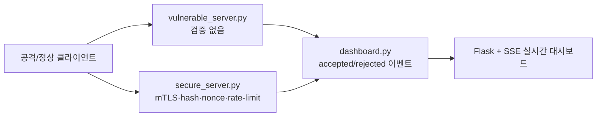

# OCPP Mini Security Lab

OCPP 1.6 전기차 충전기와 중앙 시스템 통신에서 발생할 수 있는 공격을 재현하고, **취약한 서버**와 **보안 적용 서버**가 어떻게 다르게 반응하는지 비교하는 미니 보안 테스트베드입니다.

> AI 프로젝트는 아니지만, 보안 포트폴리오용으로 "공격을 재현하고 방어 로직의 차이를 검증"하는 데 초점을 맞춘 프로젝트입니다.

## 실험 흐름



## 기술 선택 이유

| 기술 | 이유 |
|---|---|
| Python | 보안 시나리오를 빠르게 스크립트화하기 쉬움 |
| `python-ocpp` | OCPP 1.6 메시지 구조를 직접 구현하지 않고 재현 |
| `websockets` + mTLS | 충전기-중앙 시스템의 WSS 통신과 인증서 검증 실험 |
| Flask + SSE | accepted/rejected 이벤트를 가볍게 실시간 시각화 |
| SHA-256 hash + nonce + timestamp | 메시지 무결성, replay 방어 흐름을 명확히 보여줌 |

## 문제와 해결

| 문제 | 취약 서버 | 보안 서버 |
|---|---|---|
| 인증서 없이 접속 | 별도 검증 없음 | mTLS와 CA 검증으로 handshake 단계 차단 |
| 충전기 ID/serial 사칭 | 요청을 그대로 Accept | 인증서 CN, charge point ID, serial 바인딩 검사 |
| 메시지 위변조 | hash 검증 없음 | SHA-256 hash mismatch로 Reject |
| replay 공격 | 같은 요청 재전송 허용 | timestamp + nonce 재사용 차단 |
| flood 공격 | 요청을 계속 처리 | 60초 기준 rate limit 적용 |
| 잘못된 WebSocket subprotocol | 연결 유지 가능 | 연결 즉시 종료 |

## 공격 시나리오

| 파일 | 시나리오 | secure server 결과 |
|---|---|---|
| `client_normal.py` | 정상 BootNotification | Accept |
| `tamper_attack_client.py` | 잘못된 seed로 hash 위조 | Reject: hash mismatch |
| `spoof_serial_client.py` | 인증서 CN과 다른 serial 사칭 | Reject: id-binding mismatch |
| `replay_attack_client.py` | 동일 timestamp/nonce/hash 재전송 | Reject: replay nonce |
| `bad_subprotocol_client.py` | 잘못된 WebSocket subprotocol | 연결 종료 |
| `no_cert_client.py` | 클라이언트 인증서 없이 접속 | TLS handshake 차단 |
| `flood_attack_client.py` | 짧은 간격 대량 요청 | rate-limit |

## 실행

```bash
pip install -r requirements.txt

# 1) 대시보드
python dashboard.py            # http://localhost:5001

# 2) 서버: 각각 다른 터미널
python secure_server.py        # wss://localhost:8765
python vulnerable_server.py    # wss://localhost:8766

# 3) 공격 시나리오 실행
python run_all_attacks.py
```

## 솔직한 한계

| 한계 | 다음 개선 |
|---|---|
| OCPP 전체 스펙이 아니라 BootNotification 중심 | Authorize, StartTransaction 등 시나리오 확장 |
| 테스트용 인증서와 로컬 환경 기반 | 인증서 발급/폐기/회전 플로우 추가 |
| 방어 로직이 데모 목적의 단순 구현 | 운영 수준 로깅, 알림, 정책 설정 분리 |
| 실제 충전기 펌웨어/CSMS와 연동하지 않음 | 실제 OCPP 충전기 시뮬레이터와 호환성 테스트 |

## 구조

```text
secure_server.py              보안 검증 서버
vulnerable_server.py          비교용 취약 서버
client_common.py              OCPP 프레임, hash, mTLS 공통 로직
*_attack_client.py            공격 시나리오 클라이언트
run_all_attacks.py            데모 러너
dashboard.py                  Flask SSE 대시보드
templates/index.html          실시간 비교 UI
```

## 보안 참고

`ca.key`, `server.key`, `client.key` 같은 개인키 파일은 저장소에 포함하지 않습니다. 로컬에서 테스트용 CA/서버/클라이언트 인증서를 생성해 사용하세요.
